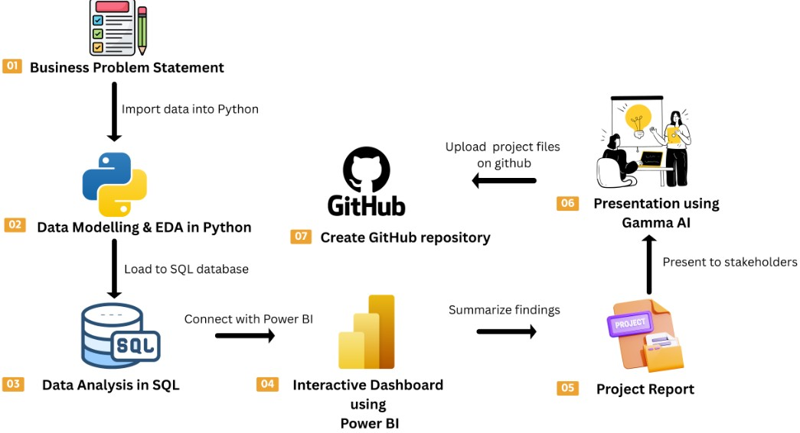
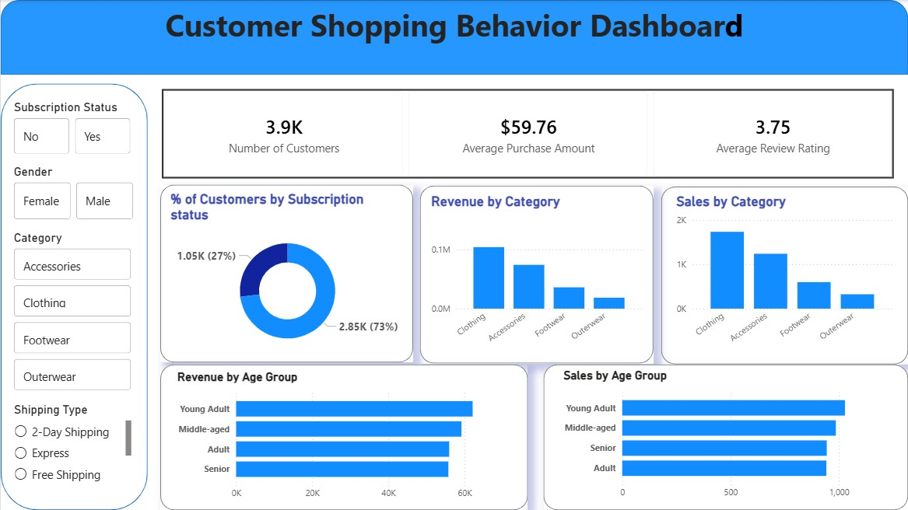

# MarketLens: Retail Customer Segmentation & Sales Analytics

## Project Overview

MarketLens is an end-to-end retail analytics project designed to analyze customer shopping behavior and transform raw transactional data into actionable business insights.

The project simulates a real-world Data Analyst workflow involving data cleaning, exploratory data analysis, SQL-based business analysis, interactive dashboard development, and business reporting.

---

## Business Problem Statement

Retail businesses generate large volumes of customer transaction data, but extracting meaningful insights from this data can be challenging.

The objective of this project is to:

- Understand customer purchasing behavior
- Identify high-value customer segments
- Analyze revenue drivers and product performance
- Evaluate subscription and discount effectiveness
- Support data-driven business decision-making

---

## Project Workflow



---

## Dataset Information

### Customer Shopping Behavior Dataset

- Total Records: 3,900
- Features: 18
- Data Type: Customer Transactions

### Key Attributes

- Customer Demographics
  - Age
  - Gender
  - Location

- Purchase Information
  - Item Purchased
  - Category
  - Purchase Amount

- Shopping Behavior
  - Subscription Status
  - Discount Applied
  - Review Rating
  - Shipping Type
  - Previous Purchases
  - Frequency of Purchases

---

## Project Architecture

### 1. Data Preparation & EDA using Python

Performed:

- Data Cleaning
- Missing Value Treatment
- Column Standardization
- Feature Engineering
- Exploratory Data Analysis (EDA)

Tools:

- Python
- Pandas
- NumPy
- Matplotlib
- Seaborn
- Jupyter Notebook

---

### 2. SQL Business Analysis

Loaded cleaned data into PostgreSQL and answered business questions such as:

- Revenue by Gender
- Customer Segmentation
- Product Performance Analysis
- Discount Impact Analysis
- Subscription Behavior Analysis
- Revenue by Age Group
- Top Products Analysis

Tools:

- PostgreSQL
- SQL

---

### 3. Interactive Dashboard using Power BI

Built an interactive dashboard containing:

- Customer Overview KPIs
- Revenue Analysis
- Sales Analysis
- Category Performance
- Customer Segmentation
- Subscription Insights
- Age Group Analysis

Tools:

- Power BI
- DAX
- Data Modeling

---

## Key Business Insights

### Customer Segmentation

Customers were segmented into:

- New Customers
- Returning Customers
- Loyal Customers

### Product Performance

Identified top-performing products based on:

- Sales Volume
- Revenue
- Customer Ratings

### Subscription Analysis

Compared:

- Subscriber Revenue
- Non-Subscriber Revenue
- Average Customer Spend

### Discount Analysis

Analyzed the impact of discounts on:

- Purchase Behavior
- Revenue Generation
- Product Demand

---

## Dashboard Preview

### Customer Behavior Dashboard



---

## Project Structure

```text
MarketLens/
│
├── data/
│   └── customer_shopping_behavior.csv
│
├── notebooks/
│   └── Customer_Shopping_Behavior_Analysis.ipynb
│
├── sql/
│   └── customer_behavior_sql_queries.sql
│
├── dashboard/
│   └── customer_behavior_dashboard.pbix
│
├── reports/
│   └── Customer Shopping Behavior Analysis.pdf
│
├── images/
│   ├── Workflow.jpg
│   └── Dashboard.jpg
│
└── README.md
```

## Technologies Used

- Python
- Pandas
- NumPy
- PostgreSQL
- SQL
- Power BI
- DAX
- Jupyter Notebook
- Git
- GitHub

---

## Business Recommendations

- Enhance customer loyalty programs
- Promote subscription-based offerings
- Optimize discount strategies
- Focus marketing efforts on high-value customer segments
- Prioritize top-performing products in campaigns